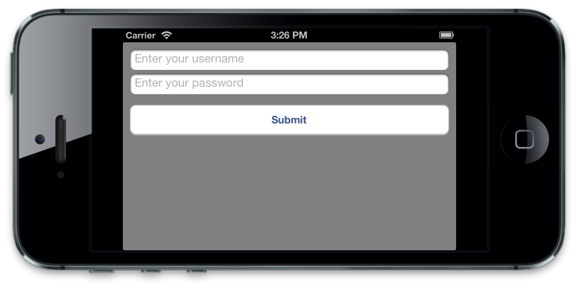

### Xamarin Simple Login



This sample is the application that will be built at the end of the [Creating iOS Applications in Code Using Visual Studio](http://developer.xamarin.com/guides/ios/application_fundamentals/ios_code_only/) guide.

#### Main.cs

เรียกใช้ `AppDelegate` ผ่านฟังก์ชั่น `UIApplication.Main`

```csharp
public class Application
{
    // This is the main entry point of the application.
    static void Main(string[] args)
    {
        // if you want to use a different Application Delegate class from "AppDelegate"
        // you can specify it here.
        UIApplication.Main(args, null, "AppDelegate");
    }
}
```

#### AppDelegate.cs

ในไฟล์ `AppDelegate.cs` ประกาศ Attribute `[Register("AppDelegate")]` สังเกตคำว่า `AppDelegate` ต้องตรงกับ `AppDelegate` ใน `Main.cs`

`FinishedLaunching` สร้าง instance ของ `CustomViewController` และ assign ใส่ `RootViewController` ของ `UIWindow`

```csharp
[Register("AppDelegate")]
public partial class AppDelegate : UIApplicationDelegate
{
    public override bool FinishedLaunching(UIApplication app, NSDictionary options)
    {
        var controller = new CustomViewController();
        // create a new window instance based on the screen size
        var window = new UIWindow (UIScreen.MainScreen.Bounds) {
            RootViewController = controller
        };

        // make the window visible
        window.MakeKeyAndVisible();

        return true;
    }
}
```

#### CustomViewController.cs

```csharp
public class CustomViewController : UIViewController
{
    public override void ViewDidLoad()
    {
        base.ViewDidLoad();
        View.BackgroundColor = UIColor.Gray;

        nfloat h = 31.0f;
        nfloat w = View.Bounds.Width;

        var usernameField = new UITextField
        {
            Placeholder = "Enter your username",
            BorderStyle = UITextBorderStyle.RoundedRect,
            Frame = new CGRect(10, 32, w - 20, h),
            AutoresizingMask = UIViewAutoresizing.FlexibleWidth
        };

        var passwordField = new UITextField
        {
            Placeholder = "Enter your password",
            BorderStyle = UITextBorderStyle.RoundedRect,
            Frame = new CGRect(10, 64, w - 20, h),
            SecureTextEntry = true,
            AutoresizingMask = UIViewAutoresizing.FlexibleWidth
        };

        var submitButton = UIButton.FromType (UIButtonType.RoundedRect);
        submitButton.Frame = new CGRect(10, 120, w - 20, 44);
        submitButton.BackgroundColor = UIColor.White;
        submitButton.Layer.CornerRadius = 5f;
        submitButton.AutoresizingMask = UIViewAutoresizing.FlexibleWidth;
        submitButton.SetTitle("Submit", UIControlState.Normal);

        submitButton.TouchUpInside += delegate
        {
            Console.WriteLine("Submit button pressed");
            var circleController = new CircleController();
            PresentViewController(circleController, true, null);
        };

        View.AddSubviews(new UIView[]{ usernameField, passwordField, submitButton });
    }
}
```


